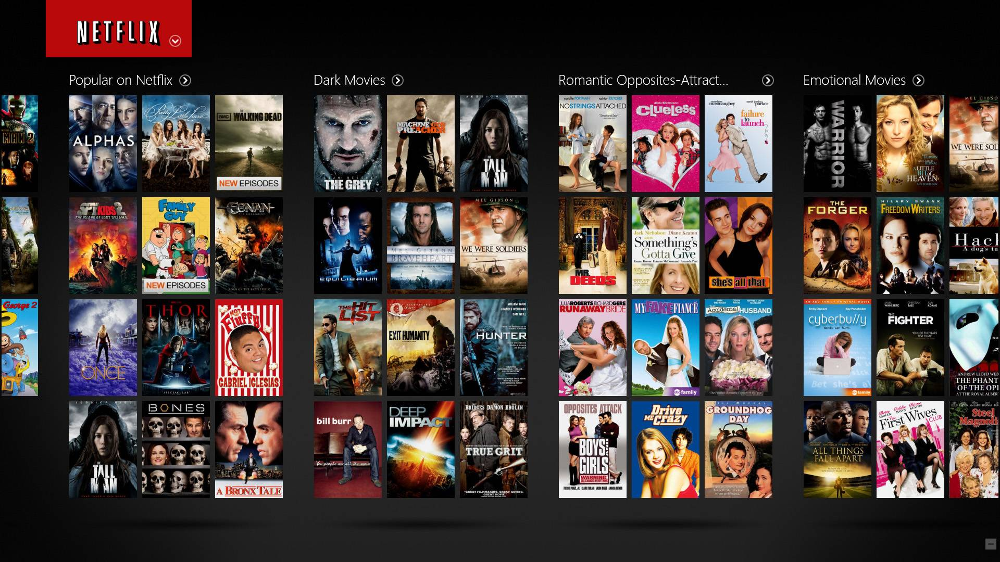
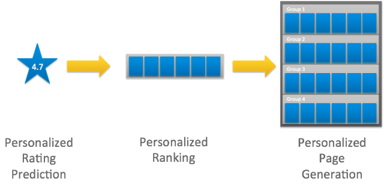

```{r setup, include=FALSE}
knitr::opts_chunk$set(eval = TRUE, results = TRUE, message = FALSE, warning = FALSE)
```

--------------------------------------------------------------------------------

# Netfix
The amazing digital success story of Netflix is incomplete without the mention of its recommender systems that focus on personalization. With over 139 million paid subscribers(total viewer pool -300 million) across 190 countries, 15,400 titles across its regional libraries and 112 Emmy Award Nominations in 2018 — Netflix is the world’s leading Internet television network and the most-valued largest streaming service in the world. Netflix uses machine learning and algorithms to help break viewers’ preconceived notions and find shows that they might not have initially chosen. To do this, it looks at nuanced threads within the content, rather than relying on broad genres to make its predictions.



## Netfix recommendation systems

**1. Content-based recommendation systems**

In a content-based recommendation system, the background knowledge of the products and customer information are taken into consideration. Based on the content that are viewed on Netflix, it provides with similar suggestions. For example, if users have watched a film that has a sci-fi genre, the content-based recommendation system will provide with suggestions for similar films that have the same genre.

**2. Collaborative filtering recommendation systems**

Unlike the content based filtering that provided recommendations of similar products, Collaborative Filtering provides recommendations based on the similar profiles of its users. One key advantage of collaborative filtering is that it is independent of the product knowledge. For example, if a person A watches crime, sci-fi and thriller genres and B watches sci-fi, thriller and action genres then A will also like action and B will like crime genre

--------------------------------------------------------------------------------

\clearpage

## Scenario Design Analysis

### Scenario Design One : netflix

#### Who are target users?

Netflix subscribers in the U.S. has an estimated 60M paid subscribers in 2019. The chosen target market is the age group of 35–44 as it is the largest growing segment by 24 percent as per available data from 2017. Projected growth of 60 percent makes this target market for the U.S. very compelling


#### What are their key goals?
* Increase user base
* Serve digital contents based on their interest 

#### How can We Help?
Facilitate matching of contents to existing customers, no interruptions of the service. Recommend contents based on users likings and filters contents based on dislike

### Scenario Design two : Subscribers

#### Who are target users?
Media producers, directors and probably actors. I never heard if Netflix sell subscriber data to media companies, may be internally using  subscriber data (liking, disliking and acceptance of recommender systems results) for producing movies, digital contents of preferred types with preferred actors and actresses.

#### What are their key goals?
Produce movies or serials which should be liked by the subscribers and give best returns

#### How can We Help?
Provide users preferences and information of most liked contents to Media producers

--------------------------------------------------------------------------------

\clearpage

## Reverse Engineer
The Netflix experience is driven by a number of machine learning algorithms: ranking, search, similarity, ratings and more. They can’t offer their entire catalogue at once so they must curate it. As quality and taste are rarely the same thing, Netflix cannot work as Rotten Tomatoes, Pitchfork or IMDb, they have to know their users and get recommendations tailored to each individual.



Whenever we access the Netflix service,  recommendations system strives to help and find a show or movie to enjoy with minimal effort. Netflix estimate the likelihood that we will watch a particular title in the catalog based on a number of factors including:

* Interactions with service (how rated other titles),
* Other members with similar tastes and preferences on our service, and
* Information about the titles, such as their genre, categories, actors, release year, etc.

In addition to knowing what users have watched on Netflix

* The time of day watch,
* The devices users are watching Netflix on, and
* How long users watch.

All of these pieces of data are used as inputs that netflix process in their algorithms. The recommendations system does not include demographic information (such as age or gender) as part of the decision making process.

In order to predict contexts, Netflix make use of representation learning. It is a deep learning technique that performs feature engineering that discovers features without explicit programming. For performing contextual predictions, Netflix treats recommendations as a sequence classification problem. It takes the input as a sequence of user-actions and performs predictions that output the next set of actions.

--------------------------------------------------------------------------------

\clearpage

## How to improve the site's recommendation capabilities going forward
* Add additional recommendation engine to suggest default contents - Ignore users watch history
* Provide stability to share recommendations between different profiles

--------------------------------------------------------------------------------

\clearpage


#### References 
https://netflix.com \
https://netflixtechblog.com/


