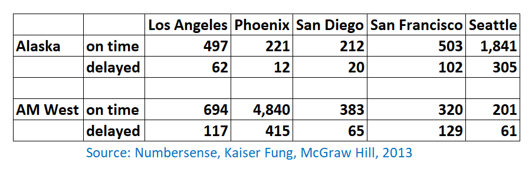
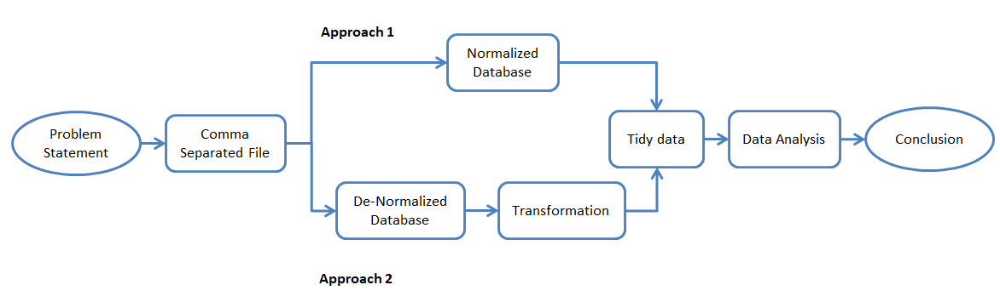
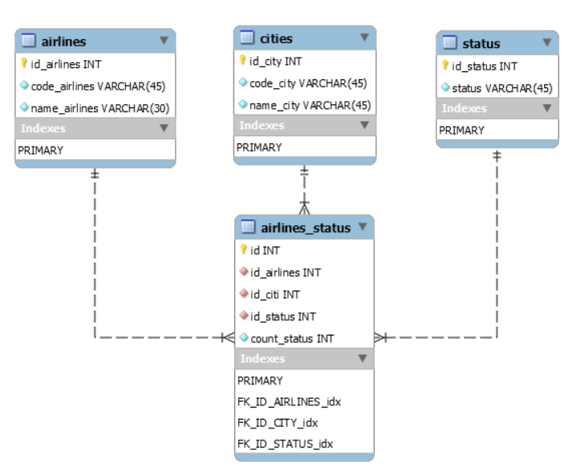
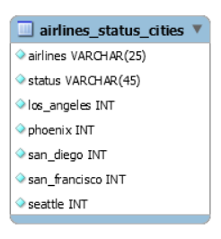

```{r setup, include=FALSE}
knitr::opts_chunk$set(echo = TRUE)
```
--------------------------------------------------------------------------------

\clearpage

# Summary
The chart below describes arrival delays for two airlines across five destinations. Counts of status - 'on time' and 'delayed' is given in the table for each airlines. Key objective is to tidying and transforming this data. Acceptance criteria and solution approach is described in next sections.\
{width=90%}

--------------------------------------------------------------------------------

\clearpage

# Acceptance Criteria
(1) Create a .CSV file (or optionally, a MySQL database!) that includes all of the information above. You’re encouraged to use a “wide” structure similar to how the information appears above, so that you can practice tidying and transformations as described below.\
(2) Read the information from your .CSV file into R, and use tidyr and dplyr as needed to tidy and transform your data.\
(3) Perform analysis to compare the arrival delays for the two airlines.\
(4) Your code should be in an R Markdown file, posted to rpubs.com, and should include narrative descriptions of your data cleanup work, analysis, and conclusions.\

--------------------------------------------------------------------------------

\clearpage

# Analysis
* This untidy data shows missing values in various cells
* A blank row with no values in any cell
* Repetition of values such as 'on time' and 'delayed'
* Name of the cities as a column names with 'on time' and 'delayed' count

--------------------------------------------------------------------------------

\clearpage

# Approach\
Two approach are implemented in this assignment\

### Approach 1: Normalized database\
* Import data entities in each normalized schema table\
* Source data into R for next steps\
* Tidy and Transform data for data analysis\

### Approach 2:  Raw database\
* Import dataset in de-normalized table\
* Source data into R for next steps\
* Tidy and Transform data for data analysis\

{width=100%}

--------------------------------------------------------------------------------

\clearpage

# Libraries & Capabilities used
```
Libraries 
* dployr
* tidyr
* ggplot
* aws.s3
* RMySQL

Capabilities 
* AWS RDS MySQL
* AWS S3
* RPubs.com
* Gitbub
```
```{r results = FALSE, message = FALSE, warning = FALSE}
# Load required libraries
library(tidyverse)
library(ggplot2)
library(dplyr)
library (readr)
library(aws.s3)
library(RMySQL)
```

--------------------------------------------------------------------------------

\clearpage

# Implementation
## Approach 1: Normalized database

### Database Objects & Design are below \
**airlines  :** To retain airlines code and name \
**cities    :** To retain city code and name \
**status    :** Airlines flight status  - on time, delayed are maintained in this table \
**airlines_status :** This table is used maintain status count and relationship with other tables \

{width=90%}
--------------------------------------------------------------------------------

clearpage

Using AWS S3 to save .CSV and .SQL files to initialize the database and use in the future \
```{r}
get_bucket(bucket = "msds-data607")
# Display contents
```
--------------------------------------------------------------------------------

**loadflights.sql**
```
DROP DATABASE IF EXISTS flights;
CREATE DATABASE `flights`
USE flights;

DROP TABLE IF EXISTS airlines_status;
DROP TABLE IF EXISTS airlines_status_cities;
DROP TABLE IF EXISTS airlines;
DROP TABLE IF EXISTS cities;
DROP TABLE IF EXISTS status;
CREATE TABLE `airlines_status_cities` (
  `airlines` varchar(25) NOT NULL,
  `status` varchar(45) NOT NULL,
  `los_angeles` int NOT NULL,
  `phoenix` int NOT NULL,
  `san_diego` int NOT NULL,
  `san_francisco` int NOT NULL,
  `seattle` int NOT NULL
);

LOAD DATA INFILE '<<Location>>\\airlines_status_cities.csv' 
INTO TABLE airlines_status_cities 
FIELDS TERMINATED BY ',' 
ENCLOSED BY '"'
LINES TERMINATED BY '\n'
IGNORE 1 ROWS;

CREATE TABLE `airlines` (
  `id_airlines` int NOT NULL,
  `code_airlines` varchar(45) NOT NULL,
  `name_airlines` varchar(30) NOT NULL,
  PRIMARY KEY (`id_airlines`)
);

LOAD DATA INFILE '<<Location>>\\airlines.csv' 
INTO TABLE airlines 
FIELDS TERMINATED BY ',' 
ENCLOSED BY '"'
LINES TERMINATED BY '\n'
IGNORE 1 ROWS;

CREATE TABLE `cities` (
  `id_city` int NOT NULL,
  `code_city` varchar(45) NOT NULL,
  `name_city` varchar(45) NOT NULL,
  PRIMARY KEY (`id_city`)
);

LOAD DATA INFILE '<<Location>>\\cities.csv' 
INTO TABLE cities 
FIELDS TERMINATED BY ',' 
ENCLOSED BY '"'
LINES TERMINATED BY '\n'
IGNORE 1 ROWS;

CREATE TABLE `status` (
  `id_status` int NOT NULL,
  `status` varchar(45) NOT NULL,
  PRIMARY KEY (`id_status`)
) ;

LOAD DATA INFILE '<<Location>>\\status.csv' 
INTO TABLE status 
FIELDS TERMINATED BY ',' 
ENCLOSED BY '"'
LINES TERMINATED BY '\n'
IGNORE 1 ROWS;

CREATE TABLE `airlines_status` (
  `id` int NOT NULL,
  `id_airlines` int NOT NULL,
  `id_city` int NOT NULL,
  `id_status` int NOT NULL,
  `count_status` int NOT NULL,
  PRIMARY KEY (`id`),
  KEY `FK_ID_AIRLINES_idx` (`id_airlines`),
  KEY `FK_ID_CITY_idx` (`id_city`),
  KEY `FK_ID_STATUS_idx` (`id_status`),
  CONSTRAINT `FK_ID_AIRLINES` FOREIGN KEY (`id_airlines`) REFERENCES `airlines` (`id_airlines`),
  CONSTRAINT `FK_ID_CITY` FOREIGN KEY (`id_city`) REFERENCES `cities` (`id_city`),
  CONSTRAINT `FK_ID_STATUS` FOREIGN KEY (`id_status`) REFERENCES `status` (`id_status`)
);

LOAD DATA INFILE '<<Location>>\\airlines_status.csv' 
INTO TABLE airlines_status 
FIELDS TERMINATED BY ',' 
ENCLOSED BY '"'
LINES TERMINATED BY '\n'
IGNORE 1 ROWS;
```
Load data into different normalized tables

**airlines.csv**
```
id_airlines,code_airlines,name_airlines
1,ALS,Alaska
2,AMW,AM West
```
**cities.csv**
```
id_city,code_city,name_city
1,LA,Los Angeles
2,PN,Phoenix
3,SD,San Diego
4,SF,San Francisco
5,ST,Seattle
```
**status.csv**
```
id_status,status
1,on time
2,delayed
```
**airlines_status.csv**
```
id,id_airlines,id_city,id_status,count_status
1,1,1,1,497
2,1,2,1,221
3,1,3,1,212
4,1,4,1,503
5,1,5,1,1841
6,1,1,2,62
7,1,2,2,12
8,1,3,2,20
9,1,4,2,102
10,1,5,2,305
11,2,1,1,694
12,2,2,1,4840
13,2,3,1,383
14,2,4,1,320
15,2,5,1,201
16,2,1,2,117
17,2,2,2,415
18,2,3,2,65
19,2,4,2,129
20,2,5,2,61
```
### Load data from RDS into R
### Initialize RDS Database connection
```{r}
# Function to return data from a table
user <- rstudioapi::askForPassword("Database username")
password <- rstudioapi::askForPassword("Database password")
connection = dbConnect(MySQL(), user = user, password = password, dbname = 'flights', host = 'msds.cbs1lxtno2zh.us-east-2.rds.amazonaws.com')
```

### Use dplyr to read data tables
```{r}
get_data<- function(table_name) {
dataset <- tbl(connection,dbplyr::in_schema("flights", table_name))
  return(dataset)
}

```
### Read data into R using dplyr
```{r}
# Using dployr to source data into R
airlines_data<-as.data.frame(get_data('airlines'))
status_data<-as.data.frame(get_data('status'))
cities_data<-as.data.frame(get_data('cities'))
airlines_status_data<-as.data.frame(get_data('airlines_status'))

# Join these data sets together
airlines_status_data <-(left_join(airlines_status_data,status_data,by = "id_status") %>%
                        left_join(cities_data,by = "id_city"))%>%
                        left_join(airlines_data,by = "id_airlines")
```

### Transform consolidated dataset
```{r}
airlines_status_data<-select(airlines_status_data,code_airlines,
                             name_airlines,status,code_city,name_city,count_status)
# This dataset is ready to tidy
print(airlines_status_data)
```

--------------------------------------------------------------------------------

\clearpage

### Tidy consolidated dataset
Lets spread and transform data into required data format
```{r}
# Lets spread to split status column into 'on time' and 'delayed' columns
airlines_status_data<-airlines_status_data %>%
    spread(status,count_status)
names(airlines_status_data)[names(airlines_status_data) == "on time"] <- "on_time"
print(airlines_status_data)
```

## Approach 2: De-normalized database
### Database Objects & Design are below \
```
airlines_status_cities : This table is used maintain tabular structure of origional datas
```

{width=30%}

--------------------------------------------------------------------------------

\clearpage

Create denormalized table
```
-- loadflights-denormalized.sql
DROP DATABASE IF EXISTS flights;
CREATE DATABASE `flights`
USE flights;

DROP TABLE IF EXISTS airlines_status_cities;
CREATE TABLE `airlines_status_cities` (
  `airlines` varchar(25) NOT NULL,
  `status` varchar(45) NOT NULL,
  `los_angeles` int NOT NULL,
  `phoenix` int NOT NULL,
  `san_diego` int NOT NULL,
  `san_francisco` int NOT NULL,
  `seattle` int NOT NULL
);

LOAD DATA INFILE 'airlines_status_cities.csv' 
INTO TABLE airlines_status_cities 
FIELDS TERMINATED BY ',' 
ENCLOSED BY '"'
LINES TERMINATED BY '\n'
IGNORE 1 ROWS;
```
Load data into denomalized table
```
airlines,status,los_angeles,phoenix,san_diego,san_francisco,seattle
Alaska,on time,497,221,212,503,1841
Alaska,delayed,62,12,20,102,305
AM West,on time,694,4840,383,320,201
AM West,delayed,117,415,65,129,61
```

--------------------------------------------------------------------------------

\clearpage

### Load data from RDS into R
```{r}
# Using dployr to source data into R
airlines_status_cities<-as.data.frame(get_data('airlines_status_cities'))
print(airlines_status_cities)
```

### Transform consolidated dataset
```{r}
airlines_status_cities<-(airlines_status_cities %>%
gather('los_angeles', 'phoenix', 'san_diego', 'san_francisco', 'seattle', key = "cities", value = "count_status"))
print(airlines_status_cities)
airlines_status_cities<-airlines_status_cities %>%
    spread(status,count_status)
names(airlines_status_cities)[names(airlines_status_cities) == "on time"] <- "on_time"
print(airlines_status_cities)

```

--------------------------------------------------------------------------------

\clearpage

## Data Analysis
### 1. Generate bar plot for delayed flights
```{r}
# This dataset is ready for data analysis
ggplot(data=airlines_status_data, aes(x=name_airlines, y =delayed, fill= name_airlines))+
    geom_bar(stat="identity")+facet_wrap(~name_city)+
    labs(title="Delayed flights by city", x= "Airlines", y = "Delay Count")+
    theme(axis.text.x = element_blank(),plot.title = element_text(hjust=1),legend.position = "right")
```

--------------------------------------------------------------------------------

\clearpage

### 2. Generate bar plot for on time flights

```{r}

ggplot(data=airlines_status_data, aes(x=name_airlines, y =on_time, fill= name_airlines))+
    geom_bar(stat="identity")+facet_wrap(~name_city)+
    labs(title="On time flights by city", x= "Airlines", y = "On time Count")+
    theme(axis.text.x = element_blank(),plot.title = element_text(hjust=1),legend.position = "right")

```

--------------------------------------------------------------------------------

\clearpage

### 3. Calculate percentages \

Lets make more use of tidyr and dployr \

```{r}

# Lets mutate to add 3 ore columns - total, percent delay, percent on time
airlines_status_data<-as.data.frame(airlines_status_data %>%
    group_by(name_airlines, name_city) %>%
    mutate(total = sum(on_time, delayed), precent_on_time = on_time / total, precent_delay = delayed  / total))
airlines_status_data

```

--------------------------------------------------------------------------------

\clearpage

### 4. Plot - % Delay for each city

```{r}
ggplot(data = airlines_status_data, 
       aes(x = name_city, y = precent_delay*100, color=name_airlines,  
           shape=name_city)) + 
  geom_point()+xlab("Cities")+ylab("% Delay")+
  ggtitle("Plot - % Delay for each city")
```

--------------------------------------------------------------------------------

\clearpage

### 5. Plot -  % On time for each city

```{r}
ggplot(data = airlines_status_data, 
       aes(x = name_city, y = precent_on_time*100, color=name_airlines,  
           shape=name_city)) + 
  geom_point()+xlab("Cities")+ylab("% On time")+
  ggtitle("Plot - % On time for each city")
  
```

# Conclutions
Following functions were used from dployr and tidyr for tidying and transforming data
```
 - tbl, in_schema
 - gathering, spread
 - joins, mutate,select, filter, group by
 ```
* dployr and tidyr are very much suitable packages for data tranformation \
* Relational database activities are performed very efficiently using tidyr\
* If use normalized data tables  - dployr and tidyr are not much needed \
* If use denormalized data tables  - dployr and tidyr are very helpful \
* A combination of Relational database, dployr and tidyr is recommended for strcutured and unstructured data transformation and analysis\
