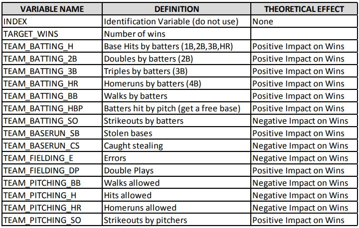

```{r setup, include=FALSE}
knitr::opts_chunk$set(echo = FALSE, warning = FALSE, message = FALSE) 
```

# 1.0 Summary

In this homework assignment, you will explore, analyze and model a data set containing approximately 2200 records. Each record represents a professional baseball team from the years 1871 to 2006 inclusive. Each record has the performance of the team for the given year, with all of the statistics adjusted to match the performance of a 162 game season.


Your objective is to build a multiple linear regression model on the training data to predict the number of wins for the team. You can only use the variables given to you (or variables that you derive from the variables provided). Below is a short description of the variables of interest in the data set:
{width=100%,height=80%}


## Deliverables:
1. A write-up submitted in PDF format. Your write-up should have four sections. Each one is described
below. You may assume you are addressing me as a fellow data scientist, so do not need to shy away
from technical details.
2. Assigned predictions (the number of wins for the team) for the evaluation data set.
3. Include your R statistical programming code in an Appendix.

## Write-up sections :
1. Data Exploration
2. Data Preparation
3. Build Models
4. Select Models

--------------------------------------------------------------------------------

\clearpage

```{r warning=FALSE, message=FALSE}
library(knitr)
library(corrgram)
library(mice)
library(caret)
library(e1071)
library(tidyr)
library(dplyr)
library(ggplot2)
library(psych)
library(reshape)
library(stringr)
library(DT)
library(data.table)
library(kableExtra)
library(corrplot)
library(DMwR2)
library(ggcorrplot)
library(car)
```


# 2.0 Data Exploration

First of all, load the data and analyze to get some insights like summary, how the data got distributed and correlation between variables and understand the data by using stats, plots and summary. The objective of this is analysis is to develop a better understanding of the data to include its shape, central tendencies, completeness (missing data) and its correlation to our response variable Target_Wins. 

```{r} 

mb_tr_data <- read.csv("https://raw.githubusercontent.com/rnivas2028/MSDS/Data621/HW1/moneyball-training-data.csv")
mb_tr_data <- mb_tr_data %>%select(-INDEX)
mb_eval_data <- read.csv("https://raw.githubusercontent.com/rnivas2028/MSDS/Data621/HW1/moneyball-evaluation-data.csv")
mb_eval_data <- mb_eval_data %>% select(-INDEX)
```

```{r} 
summary(mb_tr_data)
```

```{r} 
count(mb_tr_data)
```

```{r} 
names(mb_tr_data)
```

## View rows and columns, variable types

Glimpse of the data shows that all variables are numeric, no ctegorical variable is present here. We do lots of NA for few predcitors in the data set. In our further analysis we will try to identify :

+ Structure of the each predictors 
+ How Many NA and Zero , is it significant to remove them or replace them with some predicted value. 
+ Statistical summary of the data

```{r, warning=FALSE, message=FALSE}
glimpse(mb_tr_data)
```

Sample 6 rows with sample 7 columns
```{r, warning=FALSE, message=FALSE}
head(mb_tr_data)
```

Show entire dataset of training data
```{r, warning=FALSE, message=FALSE}
DT::datatable(mb_tr_data, options = list(pagelength=5))
```

Here are some key points from data exploration:

* here are multiple variables with missing (NA) values and TEAM-BATTING_HBP has the highest NAs.
* The data is generally complete, however, six variables have missing data. 
* The lowest complete rate is for the variable Hit By Pitch, with a rate of only 8%.
* The data set includes 2276 rows, 16 columns with all variables are numeric
* The response variable appears to be normally or near-normally distributed.

## Additional Data Exploration
### Skewness in the data :
```{r}
mb_tr_data1 = melt(mb_tr_data)
ggplot(mb_tr_data1, aes(x= value)) + 
    geom_density(fill = "grey", color="grey") + 
  facet_wrap(~variable, scales ="free", ncol = 4)
```

The majority of the explanatory variables appear to be normal or near-normal. There are however, several variable that have bi-modal distributions (Batting_HR, SO, Pitching_HR, Batting_SO) and others that are right-skewed (Fielding, Pitching_BB, Pitching_H)

```{r}
par(mfrow=c(3,5))
x <- c(2:16)
for (val in x) {
  boxplot(mb_tr_data[,val], xlab=names(mb_tr_data[val]))
}
```

### Response Variable & Correlations 
```{r}
par(mfrow=c(3,5))
for (val in x) {
plot(mb_tr_data[,val],mb_tr_data$TARGET_WINS, xlab=names(mb_tr_data[val]))
}
```

```{r}
mb_tr_data2 <- mb_tr_data[,-1 ]
names(mb_tr_data2)
cor(drop_na(mb_tr_data2))
```


```{r, echo=FALSE, warning=FALSE, message=FALSE}
mat<-as.matrix(cor(mb_tr_data2[-1],use="pairwise.complete.obs"))
corrplot(mat,tl.cex=.5)
```


```{r}
pairs.panels(mb_tr_data2[1:8]) 
pairs.panels(mb_tr_data2[9:15]) 
```

### Outliers
```{r}
ggplot(stack(mb_tr_data), aes(x = ind, y = values)) + 
  geom_boxplot() +
  coord_cartesian(ylim = c(0, 1000)) +
  theme(legend.position="none") +
  theme(axis.text.x=element_text(angle=45, hjust=1)) + 
  theme(panel.background = element_rect(fill = 'grey'))
```

### Missing, NA and Zero

We are trying to see how many `NA` is present  in the dataset. 
```{r, warning=FALSE, message=FALSE}
mb_tr_data %>% 
  gather(variable, value) %>%
  filter(is.na(value)) %>%
  group_by(variable) %>%
  tally() %>%
  mutate(percent = n / nrow(mb_tr_data) * 100) %>%
  mutate(percent = paste0(round(percent, ifelse(percent < 10, 1, 0)), "%")) %>%
  arrange(desc(n)) %>%
  kable() %>%
  kable_styling()
```

```{r, warning=FALSE, message=FALSE}
mb_tr_data %>% 
  gather(variable, value) %>%
  filter(value == 0) %>%
  group_by(variable) %>%
  tally() %>%
  mutate(percent = n / nrow(mb_tr_data) * 100) %>%
  mutate(percent = paste0(round(percent, ifelse(percent < 10, 1, 0)), "%")) %>%
  arrange(desc(n)) %>%
  kable() %>%
  kable_styling()
```
As can be inferred from above, there are very few zero values exists.

--------------------------------------------------------------------------------

\clearpage

# 3.0 Data Preparation

Data preparation will include addressing missing data, outliers and feature engineering or creating new variables.

Outliers - The box plot for Wins should some very low values (even zero). According to major league baseball, the lowest number of wins recorded by a team was 20 by the Cleveland Spiders in 1899. Therefore, I will remove all rows from the data set with wins less than 20. The highest number of wins was 116, earned by the Seattle Mariners in 2001. I will also adjust the data set accordingly.

Missing Data - EDA identified variables with missing data. Given strategy I must address the missing data for two variables: Hit By Pitch and Caught Stealing. I will utilize historical major league baseball averages of these two variable as my replacement data.

The variable TEAM_BATTING_HBP is having mostly missing values so the variable will be removed completely.
```{r}
mb_tr_data_f <- mb_tr_data[,-1 ]
names(mb_tr_data_f)

mb_tr_data_f <- mb_tr_data_f[,-10 ]
names(mb_tr_data_f )
```

TEAM_PITCHING_HR and TEAM_BATTING_HR are highly correlated, so we can remove one of them.
```{r}
mb_tr_data_f <- mb_tr_data_f[,-11 ]
names(mb_tr_data_f)
```
Imputing the NAs using Mice(pmm - predictive mean matching)
```{r}
imputed_mb_tr_data_Data <- mice(mb_tr_data_f, m=5, maxit = 5, method = 'pmm')
imputed_mb_tr_data_Data <- complete(imputed_mb_tr_data_Data)
summary(imputed_mb_tr_data_Data)
```

Centering and scaling was used to transform individual predictors in the dataset using the caret library.
```{r}
t = preProcess(imputed_mb_tr_data_Data, 
                   c("BoxCox", "center", "scale"))
mb_tr_data_final = data.frame(
      t = predict(t, imputed_mb_tr_data_Data))
summary(mb_tr_data_final)
```

```{r}
mb_tr_data_final1 = melt(mb_tr_data_final)
ggplot(mb_tr_data_final1, aes(x= value)) + 
    geom_density(fill = "grey", color="grey")+
  facet_wrap(~variable, scales = 'free') 
```

--------------------------------------------------------------------------------

\clearpage

# 4.0 Build Models

Lets utilize the training data set to create the various models. Use selected variable to build several models to predict wins. The variables selected reflect my strategy of using variables that are related to runs scored and/or runs allowed.  Next, in subsequent sections will select the best model and apply the test data set to that model.

## Model 1 - All variables included
```{r}
tr_prep <- mb_tr_data %>% 
    mutate(TEAM_TOTAL_BASES = 
           TEAM_BATTING_H + TEAM_BATTING_2B 
           + (2 * TEAM_BATTING_3B) + (3 * TEAM_BATTING_HR))

#remove variable
tr_prep = select(tr_prep, 
                 -TEAM_BATTING_H, 
                 -TEAM_BATTING_2B, 
                 -TEAM_BATTING_3B, 
                 -TEAM_BATTING_HR, 
                 -TEAM_BATTING_HBP)
# Impute missing data
colnames(tr_prep)[colSums(is.na(tr_prep)) > 0]

#impute

tr_prep = tr_prep %>% 
  mutate(TEAM_BASERUN_CS = 
           ifelse(is.na(TEAM_BASERUN_CS), 
                  mean(TEAM_BASERUN_CS, na.rm=TRUE), TEAM_BASERUN_CS)) %>% 

  mutate(TEAM_BASERUN_SB = 
           ifelse(is.na(TEAM_BASERUN_SB), 
                  mean(TEAM_BASERUN_SB, na.rm=TRUE), TEAM_BASERUN_SB)) %>% 

  mutate(TEAM_PITCHING_SO = 
           ifelse(is.na(TEAM_PITCHING_SO), 
                  mean(TEAM_PITCHING_SO, na.rm=TRUE), TEAM_PITCHING_SO)) %>% 

  mutate(TEAM_BATTING_SO = 
           ifelse(is.na(TEAM_BATTING_SO), 
                  mean(TEAM_BATTING_SO, na.rm=TRUE), TEAM_BATTING_SO)) %>% 

  mutate(TEAM_FIELDING_DP = 
           ifelse(is.na(TEAM_FIELDING_DP), 
                  mean(TEAM_FIELDING_DP, na.rm=TRUE), TEAM_FIELDING_DP))

summary(tr_prep)
```

```{r}
model1 <- lm(TARGET_WINS ~., data = tr_prep)
```

```{r}
vif(model1)
par(mfrow=c(2,2))
plot(model1)
```


## Model 2 - Excludes variables based on possible Multicollinearity
Below shows the summary, vif and diagnostics plot when TEAM_BATTING_SO, TEAM_PITCHING_BB, TEAM_PITCHING_H, TEAM_PITCHING_HR variables are excluded.
```{r}
model2 <- lm(TARGET_WINS ~ .
             - TEAM_BATTING_SO
             - TEAM_PITCHING_BB
             - TEAM_PITCHING_H
             - TEAM_PITCHING_HR, data = tr_prep)
```

```{r}
vif(model2)
par(mfrow=c(2,2))
plot(model2)
```


## Model 3 - Excludes variable based on insignificant P-value
Below shows the summary, vif and diagnostics plot when TEAM_BASERUN_CS variable is excluded.
```{r}
### Model 3 - Excludes Insignificant variables
model3 <- lm(TARGET_WINS ~ .
             - TEAM_BATTING_SO
             - TEAM_PITCHING_BB
             - TEAM_PITCHING_H
             - TEAM_PITCHING_HR
             - TEAM_BASERUN_CS, data = tr_prep)

```

```{r}
vif(model3)
par(mfrow=c(2,2))
plot(model3)
```

--------------------------------------------------------------------------------

\clearpage

# 5.0 Select Models & Predictions

```{r}
summary(model1)
summary(model2)
summary(model3)
```

Based on the 3 models, there is no significant difference in R2, Adjusted R2 and RMSE even when i did the treatment for multi-collinearity. The 3rd  one will be selected although the R-squared value is not the highest because possible multicollinearity is addressed and all included variables appear to contribute significantly to the model. The TARGET_WINS of the evaluation data set will be predicted using this Model 3. I decided to use model3 for the predictions considering its more parsimonious model. 

## Predictions:
We had to modify our predictions a bit because our final model a) predicted wins > 260 for one observation and b) -783 wins for another.   This is clearly poor performance and it may be important to find better options for our model. For now, we simply modify these outlier observations so those maxs and mins are replaced with the maxes and mins of our final training set. For the evaluation dataset also we will be doing all the pre-processing steps.
Removing the variables:

```{r}
mb_eval_data_f <- mb_eval_data[,-1 ]
mb_eval_data_f <- mb_eval_data_f[,-10 ]
mb_eval_data_f <- mb_eval_data_f[,-11 ]
imputed_mb_eval_data_Data <- mice(mb_eval_data_f, m=5, maxit = 5, method = 'pmm')
imputed_mb_eval_data_Data <- complete(imputed_mb_eval_data_Data)
t = preProcess(imputed_mb_eval_data_Data, 
                   c("BoxCox", "center", "scale"))
mb_eval_data_final = data.frame(
      t = predict(t, imputed_mb_eval_data_Data))

eval_prep <- mb_eval_data %>% 
    mutate(TEAM_TOTAL_BASES = 
           TEAM_BATTING_H + TEAM_BATTING_2B 
           + (2 * TEAM_BATTING_3B) + (3 * TEAM_BATTING_HR))

#remove variable
eval_prep = select(eval_prep, 
                 -TEAM_BATTING_H, 
                 -TEAM_BATTING_2B, 
                 -TEAM_BATTING_3B, 
                 -TEAM_BATTING_HR, 
                 -TEAM_BATTING_HBP)
# Impute missing data
colnames(eval_prep)[colSums(is.na(eval_prep)) > 0]

#impute

eval_prep = eval_prep %>% 
mutate(TEAM_BASERUN_CS = 
           ifelse(is.na(TEAM_BASERUN_CS), 
                  mean(TEAM_BASERUN_CS, na.rm=TRUE), TEAM_BASERUN_CS)) %>% 

mutate(TEAM_BASERUN_SB = 
         ifelse(is.na(TEAM_BASERUN_SB), 
                mean(TEAM_BASERUN_SB, na.rm=TRUE), TEAM_BASERUN_SB)) %>% 

mutate(TEAM_PITCHING_SO = 
         ifelse(is.na(TEAM_PITCHING_SO), 
                mean(TEAM_PITCHING_SO, na.rm=TRUE), TEAM_PITCHING_SO)) %>% 

mutate(TEAM_BATTING_SO = 
         ifelse(is.na(TEAM_BATTING_SO), 
                mean(TEAM_BATTING_SO, na.rm=TRUE), TEAM_BATTING_SO)) %>% 

mutate(TEAM_FIELDING_DP = 
         ifelse(is.na(TEAM_FIELDING_DP), 
                  mean(TEAM_FIELDING_DP, na.rm=TRUE), TEAM_FIELDING_DP))
```

```{r}
eval_data <- predict(model3, newdata = eval_prep, interval="prediction")
```

```{r}
summary(eval_data)
```
```{r}
par(mfrow=c(2,2))
plot(eval_data)
```

--------------------------------------------------------------------------------

\clearpage

# 6.0 References
## Bibliography
Diez, D.M., Barr, C.D., & Cetinkaya-Rundel, M. (2015). OpenIntro Statistics, Third Edition. Open Source. Print

Faraway, J. J. (2015). Extending linear models with R, Second Edition. Boca Raton, FL: Chapman & Hall/CRC. Print

Fox, John (2016). Applied Regression Analysis and Generalized Linear Models, Third Edition. Los Angeles, CA: Sage. Print.

# 7.0 Resource Links
http://www.baseball-almanac.com/

http://tangotiger.net/wiki_archive/Base_Runs.html

https://www.kaggle.com/junkal/selecting-the-best-regression-model

https://www.listendata.com/2018/03/regression-analysis.html
