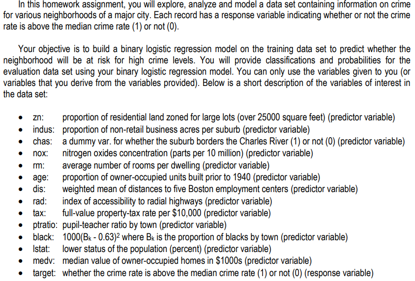
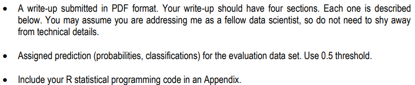

```{r setup, include=FALSE}
knitr::opts_chunk$set(echo = TRUE, warning = FALSE, message = FALSE) 
```

\clearpage

--------------------------------------------------------------------------------

# 1.0 Overview



## 1.1 Deliverables


\clearpage

--------------------------------------------------------------------------------

## Solution Steps & Approach

* Data Exploration : The crime data training dataset has 14 columns and 466 rows. The columns are predictor variables about the dataset such as age and tax.

* Data Preparation : To prepare the data, we checked for any NA's or missing values. There were none.

* Build Models : We built a model using all predictors as numerics.

* Select Models :Select a suitable model

*  Appendix

\clearpage

--------------------------------------------------------------------------------

## Import Libraries and Data

```{r}
# load required packages
library(ggplot2)
library(dplyr)
library(corrplot)
library(MASS)
library(caret)
library(RCurl)
library(pROC)
library(RCurl)
library(haven)
```

```{r}
# Loading the data
train_df = read.csv("https://raw.githubusercontent.com/rnivas2028/MSDS/Data621/HW3/crime-training-data_modified.csv")
test_df = read.csv("https://raw.githubusercontent.com/rnivas2028/MSDS/Data621/HW3/crime-evaluation-data_modified.csv")
head(train_df)
```

# 2.0 Data Exploration & Preparation

The columns are predictor variables about the dataset such as age and tax. The crime data training dataset has 14 columns and 466 rows. To explore the training data, we used:
- summary function to see means, medians, and quartiles and missing values. Fortunately, we had no missing values.
- correlation plot to find related predictors. For example, nox and dis had a large negative correlation.
- str function to see the data type of each predictor variable

We also used the summary and str functions to explore the test dataset. We found that the response variable "target" is binary and a value of 1 indicates crime rate is above median crime rate and 0 indicates crime rate is not above median crime rate.

See a summary of each column in the train_df set
```{r train_dfing_data_summary}
# view a summary of all columns
summary(train_df)
```

```{r}
# look at correlations 
cor_train = cor(train_df,  use = "na.or.complete")
corrplot(cor_train)
```

```{r}
# data type of predictors
str(train_df)
str(test_df)
```

```{r}
par(mfrow=c(2,2))
# plot response variable "target" against predictor variable "age" 
plot(train_df$age,train_df$target)
boxplot(age ~ target, train_df )
# plot response variable "target" against predictor variable "ptratio"
plot(train_df$ptratio,train_df$target)
boxplot(ptratio ~ target, train_df)
```

To prepare the data, we checked for any NA's or missing values. There were none. Then, we plotted many individual predictors against the response to look at effect. For example:

1. The plot of "target" against "age" shows target equalling one (above median crime rate) increases as the proportion of owner-occupied units built prior to 1940 increaases; the boxplot further shows that a larger mean of proportions of owner-occupied units built prior to 1940 is assoicated with higher crime rate.
2. Plots of crime rate against pupil-teacher ratio indicate higher crime rate "1" is associated with higher pupil-teacher ratio.

Otherwise, the data was well-prepared to setup the Binary Logisitic Regression model.

```{r}
has_NA = names(which(sapply(train_df, anyNA)))
has_NA
```
There are no NAs

\clearpage

--------------------------------------------------------------------------------

# 4.0 Build Models

First, we built a model using all predictors as numerics. This yielded an AIC of 218.05 and accuracy of 0.9163.

But, based on the data dictionary in the given HW3 pdf it we thought it would be more fitting to treat the variables "chas" and "rad" as factors. So, we built a second model using "chas" and "rad" as factors and got an AIC of 157.2 and an accuracy of 0.97.

### Binary Logistic Regression

```{r}
# preliminary exploration glm models
glm(formula = target ~ age, family = binomial(), data = train_df)
glm(formula = target ~ ptratio , family = binomial(), data = train_df)
```

### All predictor models

```{r}
all_preds = glm(target ~ ., family = binomial, data = train_df)
summary(all_preds)
train_df$preds = ifelse(all_preds$fitted.values > 0.5, 1, 0)

# look at confusion matrix
cm = confusionMatrix(as_factor(train_df$preds), as_factor(train_df$target), positive = "1")
cm
```


```{r}
step_all_preds = stepAIC(all_preds)
summary(step_all_preds)
train_df$preds = ifelse(step_all_preds$fitted.values > 0.5, 1, 0)

# look at confusion matrix
cm = confusionMatrix(as_factor(train_df$preds), as_factor(train_df$target), positive = "1")
cm
```

### Try treating chas and rad as factors

```{r}
# Based on data dictionary in hw assignment pdf and looking at the df,
# chas and rad should probably be factors
train_df2 = cbind(train_df)
train_df2$chas = as.factor(train_df2$chas)
train_df2$rad = as.factor(train_df2$rad)
all_preds_fac = glm(target ~ ., family = binomial, data = train_df2)
summary(all_preds_fac)
train_df2$preds = ifelse(all_preds_fac$fitted.values > 0.5, 1, 0)

# look at confusion matrix
cm = confusionMatrix(as_factor(train_df2$preds), as_factor(train_df2$target), positive = "1")
cm
```

```{r}
step_all_preds_fac = stepAIC(all_preds_fac)
summary(step_all_preds_fac)
train_df2$preds = ifelse(step_all_preds_fac$fitted.values > 0.5, 1, 0)
train_df2$pred_proba = step_all_preds_fac$fitted.values

# look at confusion matrix
cm = confusionMatrix(as_factor(train_df2$preds), as_factor(train_df2$target), positive = "1")
cm
```

```{r}
hist(step_all_preds_fac$fitted.values,
     main= "Histogram of Predicted Probabilities",
     xlab="Predicted Probabilities")
```

```{r}
proc = roc(train_df2$target, train_df2$pred_proba)
plot(proc, asp=NA, legacy.axes=TRUE, print.auc=TRUE, xlab="Specificity")
```

--------------------------------------------------------------------------------

\clearpage

# Appendix
* Diez, D.M., Barr, C.D., & Cetinkaya-Rundel, M. (2015). OpenIntro Statistics, Third Edition. Open Source. Print

* Faraway, J. J. (2015). Extending linear models with R, Second Edition. Boca Raton, FL: Chapman & Hall/CRC. Print

* https://www.sciencedirect.com/topics/computer-science/binary-logistic-regression

* https://bookdown.org/chua/ber642_advanced_regression/binary-logistic-regression.html

* http://wise.cgu.edu/wp-content/uploads/2016/07/Introduction-to-Logistic-Regression.pdf