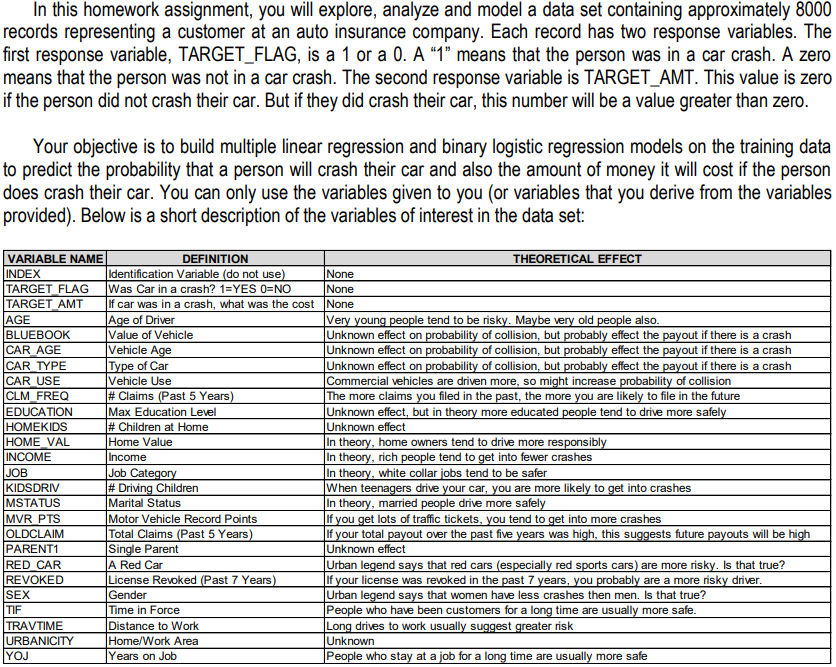
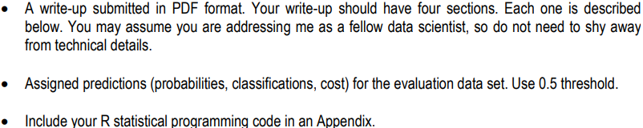

```{r setup, include=FALSE}
knitr::opts_chunk$set(echo = TRUE, warning = FALSE, message = FALSE) 
```

\clearpage

--------------------------------------------------------------------------------

# 1.0 Overview



## 1.1 Deliverables


\clearpage

--------------------------------------------------------------------------------

## Solution Steps & Approach

* Data Exploration : The crime data training dataset has 14 columns and 466 rows. The columns are predictor variables about the dataset such as age and tax.

* Data Preparation : To prepare the data, we checked for any NA's or missing values. There were none.

* Build Models : We built a model using all predictors as numerics.

* Select Models :Select a suitable model

*  Appendix

\clearpage

--------------------------------------------------------------------------------

## Import Libraries and Data

```{r echo=FALSE}
library(ggplot2)
library(dplyr)
library(corrplot)
library(MASS)
library(caret)
library(RCurl)
library(pROC)
library(RCurl)
library(haven)
```


```{r}
# Loading the data
train_df = read.csv("https://raw.githubusercontent.com/rnivas2028/MSDS/Data621/HW4/insurance_training_data.csv")
test_df = read.csv("https://raw.githubusercontent.com/rnivas2028/MSDS/Data621/HW4/insurance-evaluation-data")
head(train_df)
```

# 2.0 Data Exploration & Preparation

The auto insurance training dataset has 26 variables and 8161 observations. Of the variables, 24 of them are predictors for two responses: TARGET_FLAG and TARGET_AMT is numerical. 

To explore the training data, used:
 * Summary function to see means, medians, and quartiles of predictors
 * Str function to see the data type of each predictor
 * Explored TARGET_FLAG in relation to some other variables such as AGE and CAR_AGE
 * Looked at distribution of some numerical variables such as AGE and MVR_PTS

From the summary function, the TARGET_FLAG is binary and 26% of the 8161 records were accidents.
See a summary of each column in the train_df set
```{r train_dfing_data_summary}
# view a summary of all columns
summary(train_df)
```

Look at the data type of each variable
```{r}
# data type of predictors
str(train_df)
```

Look at the relationship between TARGET_FLAG and some of the numerical variables.
```{r}
par(mfrow=c(1,2))
# plot response variable "target" against predictor variable "age" and "car_age"
boxplot(AGE ~ TARGET_FLAG, train_df, 
        main="Target vs Age",
        xlab="Target",
        ylab="Age") 
boxplot(CAR_AGE ~ TARGET_FLAG, train_df, 
        main="Target vs Car Age",
        xlab="Target",
        ylab="Car Age")
```

Look at the distribution of some numerical variables.
```{r}
h <- hist(train_df$AGE)
text(h$mids,h$counts,labels=h$counts)
```

```{r}
h <- hist(train_df$MVR_PTS)
text(h$mids,h$counts,labels=h$counts)
```

This data was prepared to build both a binary logistic model and a multiple linear regression model. The binary logisitc model was used to predict the TARGET_FLAG response variable and the multiple linear regression model was used to predict the TARGET_AMT variable. Thus, there was a different training dataset prepared for each model.

In both training datasets, all 948 records with at least one missing value were removed.

Then, in the multiple linear regression training dataset all records with TARGET_AMT = 0 were removed.

Check for NA's
```{r}
has_NA = names(which(sapply(train_df, anyNA)))
has_NA
```

Remove rows with NA's
train_df will be used for binary logistic regression model
```{r}
train_df <- train_df[complete.cases(train_df), ]
```

The training dataset for the binary logistic regression model was labelled train_df. The training dataset for the multiple linear regression model was titled train_amt_df.

Create train_amt_df dataframe for multiple linear regression model
```{r}
train_amt_df <- subset(train_df, TARGET_AMT > 0)
summary(train_amt_df$TARGET_FLAG)
```

\clearpage

--------------------------------------------------------------------------------

# 4.0 Build Models

First, we built two models using most predictors as numerics. Then we used the step AIC function to find the best variables for each model.

One model was a Binary Logistic Regression model for the TARGET_FLAG response titled step_BLR.
The second model was a Multiple Linear Regression for the TARGET_AMT response titled MLR_all_vars

## Binary Logistic Regression

```{r}
# preliminary exploration with one predictor
model1 <- glm(formula = TARGET_FLAG ~ AGE, family = binomial(), data = train_df)
summary(model1)
```

Binary Logistic Regression Model with more variables
```{r}
BLR_all_vars = glm(TARGET_FLAG ~ AGE +
                  CAR_AGE +
                  MVR_PTS +
                  YOJ +
                  CLM_FREQ +
                  TIF, family = binomial(), data = train_df)
summary(BLR_all_vars)
```

Step through AIC scores to find best model
```{r}
step_BLR = stepAIC(BLR_all_vars)
summary(step_BLR)
```

## Multiple Linear Regression

Multiple Linear Regression models with many variables
```{r}
MLR_all_vars = lm(TARGET_AMT ~ AGE +
                  CAR_AGE +
                  MVR_PTS +
                  YOJ +
                  CLM_FREQ +
                  TIF, data = train_amt_df)
summary(MLR_all_vars)
```

\clearpage

--------------------------------------------------------------------------------

# 5.0 Select Models


--------------------------------------------------------------------------------

\clearpage

# Appendix
* Diez, D.M., Barr, C.D., & Cetinkaya-Rundel, M. (2015). OpenIntro Statistics, Third Edition. Open Source. Print

* Faraway, J. J. (2015). Extending linear models with R, Second Edition. Boca Raton, FL: Chapman & Hall/CRC. Print

* https://www.sciencedirect.com/topics/computer-science/binary-logistic-regression

* https://bookdown.org/chua/ber642_advanced_regression/binary-logistic-regression.html

* http://wise.cgu.edu/wp-content/uploads/2016/07/Introduction-to-Logistic-Regression.pdf